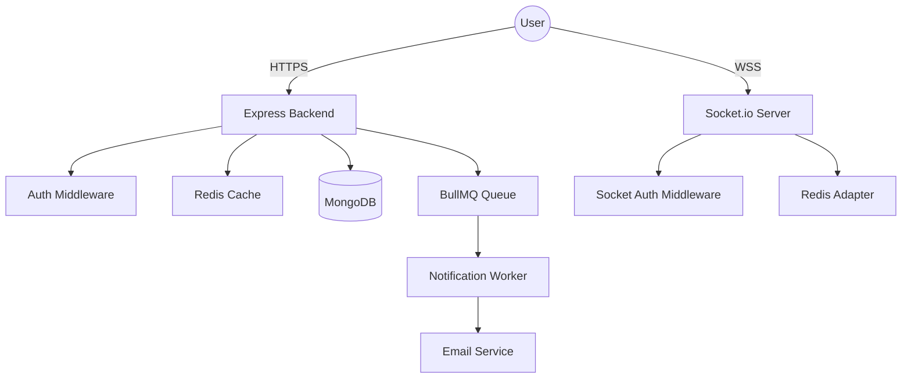

# Sustainable Local Marketplace — Backend

A production-grade, real-time marketplace backend built with Node.js, Socket.io, Redis, and MongoDB. Designed for stability, scalability, and security.

## 🚀 Key Features

- **Real-time Bidding & Chat**: Powered by Socket.io with Redis Pub/Sub for horizontal scaling.
- **Atomic Order Processing**: Secure stock management and checkout.
- **Secure Payments**: Integrated with Razorpay.
- **High Performance**: Redis-based caching layer and BullMQ background workers.
- **Security Hardened**: Helmet, Rate Limiting, and JWT-based authentication.
- **Standardized Error Handling**: Custom AppError utility for clear API responses.
- **Dockerized**: Containerized for seamless deployment.

## 🛠️ Architecure Diagram



## 🧰 Technical Stack

- **Runtime**: Node.js (ES Modules)
- **Framework**: Express.js
- **Database**: MongoDB (Mongoose)
- **Cache**: Redis (ioredis)
- **Real-time**: Socket.io
- **Queuing**: BullMQ
- **Validation**: Zod
- **Security**: JWT, Bcrypt, Helmet, Express-Rate-Limit
- **Logging**: Morgan, Winston
- **DevOps**: Docker, Docker Compose

## ⚡ Quick Start (Docker)

1. **Clone and Enter**:
   ```bash
   git clone <repo-url>
   cd sustainable-marketplace
   ```

2. **Setup Environment**:
   Create a `.env` file in the `backend` folder (see `.env.example`).

3. **Run Services**:
   ```bash
   docker-compose up --build
   ```

## 🧪 Testing

We use multiple test suites to ensure system integrity:

- **End-to-End**: `node tests/integration_test.js`
- **Real-time**: `node tests/socket-tests.js`
- **Unit/Service**: `node tests/run-tests.js`

## 📄 License
MIT
