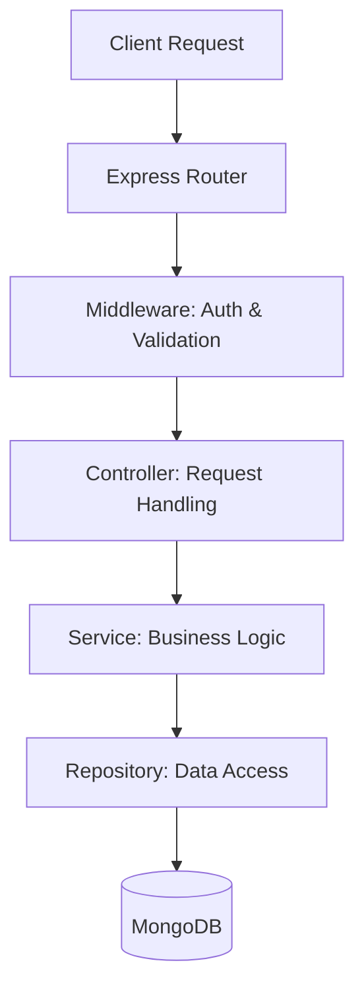

# 🌱 Sustainable Local Marketplace API

[](https://nodejs.org/)
[](https://expressjs.com/)
[](https://www.mongodb.com/)
[](https://zod.dev/)

A professional-grade backend API for a sustainable e-commerce ecosystem. Built with a focus on **Software Engineering patterns**, **Security**, and **Scalability**.

---

## 🏗️ System Architecture

This project implements a strict **Service-Repository Pattern** to ensure a clean separation of concerns and high testability.



### Key Engineering Decisions
- **Decoupled Layers**: Controllers handle HTTP semantics, Services handle complex logic/security, and Repositories handle raw DB queries.
- **RBAC (Role-Based Access Control)**: Custom middleware manages access levels for Buyers, Sellers, and Admins.
- **Ownership Security**: Products can only be modified or deleted by their original creators, enforced at the service level.

---

## 🚀 Key Features

### 🔐 Authentication & Security
- **JWT-based Auth**: Secure stateless authentication.
- **Role Enforcement**: Strict checks for `seller` specific actions.
- **Data Protection**: Automatic password hashing and exclusion from API responses using Mongoose projections.

### 📦 Marketplace Intelligence
- **Product Lifecycle**: Full CRUD operations with Zod-backed validation.
- **Smart Filtering**: Server-side filtering by category and dynamic price ranges (`minPrice`, `maxPrice`).
- **Efficient Pagination**: Integrated `limit` and `skip` mechanics for optimized performance.
- **Sustainability Scoring**: Native support for sustainability metrics on every product.

---

## 🛠️ Tech Stack

- **Runtime**: Node.js (v18+)
- **Framework**: Express.js
- **Database**: MongoDB with Mongoose ODM
- **Validation**: Zod (Type-safe schema validation)
- **Security**: Bcrypt (Hashing), JWT (Tokens)

---

## 🚦 API Documentation

### Authentication
| Endpoint | Method | Access | Description |
| :--- | :--- | :--- | :--- |
| `/api/auth/register` | `POST` | Public | Register as a Buyer or Seller |
| `/api/auth/login` | `POST` | Public | Authenticate and get Access Token |

### Product Management
| Endpoint | Method | Access | Description |
| :--- | :--- | :--- | :--- |
| `/api/products` | `GET` | Public | List products (Filters & Pagination) |
| `/api/products` | `POST` | Seller | Create a new listing |
| `/api/products/:id` | `PUT` | Owner | Update listing details |
| `/api/products/:id` | `DELETE` | Owner | Remove listing from marketplace |

---

## 🧪 Testing & Quality Assurance

Quality is verified empirically using automated test suites with an **in-memory MongoDB database**.

```bash
# Execute Authentication Tests
node tests/run-tests.js

# Execute Marketplace Logic & Security Tests
node tests/product-tests.js
```

---

## ⚙️ Local Setup

1. **Clone the project**
2. **Install dependencies**: `npm install` inside the `backend` folder.
3. **Configure Environment**: Create a `.env` file based on the parameters listed in the code.
4. **Run Development Mode**: `npm run dev`

---

## 📝 Audit Results
This project has undergone a complete logic and security audit. **All Day 1, 2, and 3 milestones are completed and verified.**
See [Project_Audit_Final.md](file:///e:/Susainable/audit%20Report/Project_Audit_Final.md) for full details.

Developed with ❤️ as a sustainable commerce solution.
